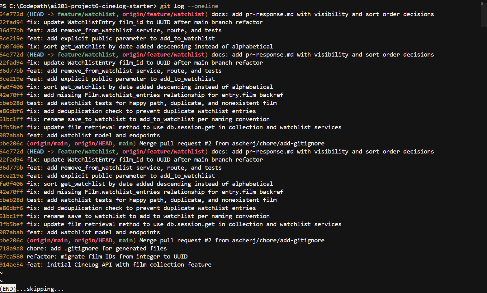

# PR Response Doc — CineLog Watchlist Feature

## AI Usage
This entire session was done with Claude Code as an active collaborator, not just for spot-checks — worth being upfront about that rather than implying otherwise. Specific uses:
- **Orientation:** read `models.py`, `services/collection_service.py`, `tests/test_collection.py`, and the watchlist code before looking at any review comment, to learn the `verb_to_noun` naming convention, the dedup pattern (query-then-raise), and the fixture/test structure, then applied those same patterns to the watchlist code (Comments 1–3).
- **Bug discovery via verification:** while implementing Comment 5, ran the new sort-order test and hit a pre-existing `AttributeError` (`WatchlistEntry` had no `film` backref) that had nothing to do with the sort change. Fixed it in its own commit rather than folding it silently into the sort-order commit, and confirmed via `git show HEAD~4` that it predated this session's changes.
- **Stress-testing Comments 4 and 5:** after drafting the design-decision reasoning myself, had a fresh, independent agent (no prior context on this conversation) read only the code and the draft response and argue the strongest counterpoint against each position. For Comment 4, it caught that my "discovery value" justification was aspirational — nothing in the codebase actually consumes the `public` flag yet — so I rewrote that section around a more honest, technically specific argument (default stickiness for already-created rows, given enforcement doesn't exist yet). For Comment 5, it pushed back on my dismissal of the "alphabetical helps you re-find a title" use case; I revised the response to engage with that directly instead of hand-waving it. Both final positions and all reasoning are mine — the agent's job was only to find the weakest point in what I'd already written, not to write it.

## Comment 1 — Rename
**What I did:** Renamed `save_to_watchlist()` to `add_to_watchlist()` in `services/watchlist_service.py`, matching the `verb_to_noun` convention used by `add_to_collection()` / `remove_from_collection()` / `get_collection()` in `services/collection_service.py`. Updated the docstring's first line ("Save a film..." → "Add a film...") to match, and updated the one call site in `routes/watchlist/watchlist.py` (both the import and the function call).
**How I verified:** Ran `grep -rn save_to_watchlist` across the repo before and after the change — one hit in the service definition and one call site in the route, both updated, zero hits left afterward. Ran `pytest tests/ -v` (4 passed) to confirm the rename didn't break anything already covered.

## Comment 2 — Deduplication
**What I did:** Added an `AlreadyOnWatchlistError` exception and a duplicate check in `add_to_watchlist()`, mirroring `add_to_collection()`'s pattern in `services/collection_service.py` exactly: query `WatchlistEntry.query.filter_by(user_id=user_id, film_id=film_id).first()` before inserting, and raise if an entry already exists. I also updated `routes/watchlist/watchlist.py` to catch both `FilmNotFoundError` (404) and the new `AlreadyOnWatchlistError` (409), matching how `routes/collection.py` translates the same two exceptions to HTTP status codes — without this, the new exception would otherwise bubble up as an unhandled 500 instead of a meaningful response.
**How I verified:** Manually exercised the function in a throwaway script against an in-memory DB — first call succeeds, second call with the same `user_id`/`film_id` raises `AlreadyOnWatchlistError` instead of silently inserting a second row. Ran `pytest tests/ -v` (4 passed) to confirm no regressions. A permanent automated test for this case is added as the "second test" in Comment 3 / the stretch section.

## Comment 3 — Missing test
**What I did:** Created `tests/test_watchlist.py`, mirroring the fixture setup (`app`, `sample_user`, `sample_film`) and structure from `tests/test_collection.py`. Added `test_add_to_watchlist_nonexistent_film_raises`, the direct equivalent of `test_add_to_collection_nonexistent_film_raises` — asserts `FilmNotFoundError` is raised when `add_to_watchlist()` is called with a `film_id` that doesn't exist. Following CONTRIBUTING.md's testing guidance ("include at least: happy path, duplicate/conflict, nonexistent ID" for a service function), I also added `test_add_to_watchlist_creates_entry` (happy path) and `test_add_to_watchlist_duplicate_raises` (locks in the Comment 2 dedup behavior with an automated test, since that change previously only had manual verification). The duplicate-entry test is my chosen "second test" edge case for the stretch goal — see rationale in the test's docstring.
**How I verified:** `pytest tests/ -v` — all 7 tests pass (4 existing collection tests + 3 new watchlist tests).

## Comment 4 — Default visibility
**My position:** Keep `public=True` as the default for new watchlist entries, but make it an explicit, overridable parameter (`add_to_watchlist(user_id, film_id, public=True)`) instead of a silent model default the caller can't see or control.

**Reasoning:** I want to be precise about what this default actually does *today*, because that changes the argument. I checked `get_watchlist()` and confirmed it returns every entry's fields unfiltered, regardless of `public` — there is no discovery endpoint, no "friends' watchlists" feature, no viewer-based access check anywhere in this codebase. So `public` is currently inert metadata: no code path treats a `False` entry any differently from a `True` one. That means neither default has any real-world consequence *right now* — the decision isn't "which default protects users today" (neither does), it's "which starting value do we want already sitting in the database for the day enforcement and a discovery feature actually ship." Defaults are sticky for rows already created: if I shipped `public=False` today, then a discovery feature landed six months from now, every watchlist entry created in the meantime would be invisible to it unless someone ran a backfill — silently defeating the feature for all early data. Shipping `public=True` now costs nothing today (nothing restricts on it yet) and doesn't foreclose that future feature. It's also consistent with `CollectionEntry`, which has no visibility field at all and is implicitly fully exposed via `GET /collection/<user_id>` — so a private-by-default watchlist would be a stricter privacy stance than the rest of the app has ever taken, introduced with no enforcement mechanism to back it up.

**Tradeoff acknowledged:** A watchlist is arguably more sensitive than a collection — it exposes forward-looking intent/taste (e.g., wanting to watch something a user might feel is embarrassing, or a partner's surprise) rather than verified past behavior, so there's a real argument that intent-signaling data deserves more caution than a public-by-default policy gives it, independent of whether anything enforces it yet. I'm not overriding that concern with the rows-already-created argument — I'm addressing it by making `public` an explicit, callable parameter (`add_to_watchlist(..., public=True)`) instead of only a buried model default, so a caller who does care can opt a specific entry out immediately, without waiting for a settings UI. But I'll say directly: **before this feature is presented to end users as privacy-respecting, `public` needs to actually be enforced** (filtering non-owner reads by the flag) — right now the field is a placeholder for a decision that hasn't been wired up, and that's a real gap I'm flagging rather than fixing here, since it's outside these six comments.

## Comment 5 — Sort order
**My position:** Agreed — implemented date-added descending (newest first) as the default sort for `get_watchlist()`, replacing the alphabetical (`Film.title.asc()`) sort.

**Reasoning:** Beyond just deferring to the reviewer's stated preference, this brings the watchlist in line with `get_collection()`, which already sorts by `date_added.desc()` ("newest first," per its own docstring). The two functions are structurally the same shape — a user's list of (film, timestamp) associations — and having one sort chronologically while the other sorts alphabetically is an inconsistency a future maintainer would have to explain, not a deliberate design choice. My best guess for how the original alphabetical sort ended up on the watchlist is that it mirrored `list_films()` in `routes/films.py`, which sorts by `Film.title` because it's a catalog-browsing endpoint — a reasonable default for browsing all films, but the wrong precedent to copy for a personal, time-ordered list.

**Engagement with reviewer's point:** The reviewer's argument ("most users want to see what they added recently") is really a claim about recency bias in personal lists, and CineLog has already made that same bet once, for collections. But I don't want to wave away the real counterargument to it: a watchlist, unlike a collection, is something users actively *re-consult* to decide what to watch next, and as it grows, alphabetical order genuinely helps you re-find a specific remembered title, while pure recency ordering doesn't. That's a legitimate CineLog-specific tension, not a generic one — collections are more of a historical log you rarely need to search, watchlists are a queue you return to. I didn't resolve this by adding a `?sort=` parameter, because that's a real feature (search/filter) the app doesn't have for *either* list today, and building it for only the newer feature would be new scope beyond what was asked. My actual position: the "hard to find one title in a long list" problem is a search/filter gap, not an argument against a sensible default — and CineLog already accepted that same gap for collections when it chose `date_added.desc()` there. If this becomes a real pain point, the fix is a search endpoint on the watchlist, not keeping alphabetical as the default sort. While making this change I also fixed a bug that blocked verifying it: `models.py` was missing `Film.watchlist_entries = db.relationship("WatchlistEntry", backref="film", lazy=True)`, so `entry.film` in `get_watchlist()` raised `AttributeError` for any non-empty watchlist — this predates my changes (confirmed via `git show HEAD~4`) and wasn't one of the six review comments, but it made `get_watchlist()` completely unusable, so I fixed it in its own commit to unblock testing the sort order at all.
**How I verified:** Added `test_get_watchlist_returns_newest_first`, mirroring `test_get_collection_returns_newest_first` exactly (two films added out of alphabetical order but in a known time order; asserts the later one comes first). `pytest tests/ -v` passes (9/9). Also manually verified end-to-end through the Flask test client (`POST /watchlist/<user_id>/add`, `GET /watchlist/<user_id>`) to confirm the route layer behaves correctly, not just the service function in isolation.

## Comment 6 — Rebase
**What conflicted:** Ran `git fetch origin && git rebase origin/main`. `main` had moved forward with `07ca580` ("refactor: migrate film IDs from integer to UUID") plus a later `.gitignore` merge commit. Two things surfaced:
1. An explicit conflict on `.gitignore` — I had independently added one before starting (per Milestone 1) with the same intent as an unrelated PR already merged to `main`. Git flagged an add/add conflict since both sides created the file from scratch.
2. A silent, **non-conflicting** loss of data: `main`'s refactor commit had deleted the entire `WatchlistEntry` class from `models.py` (since that model didn't exist on `main`'s line — it only ever lived on this feature branch, but happened to be present in the shared base commit `models.py` that both branches forked from). None of my commits ever modified that class definition (they only ever added a `watchlist_entries` relationship line pointing at it), so git's 3-way merge per commit saw "unchanged on my side, deleted on main's side" and silently took the deletion — with no conflict markers and no error. This is a known git rebase gotcha: a real dependency between "my code" and "content I never touched" isn't visible to a line-based 3-way merge.

**How I resolved it:** For the `.gitignore` conflict, merged the two versions by hand (mine added `.venv/`/`venv/`, the already-merged one added `.pytest_cache/` — kept the union, no lines lost). For the silently-dropped model: I only caught it because I ran `pytest` immediately after the rebase finished instead of assuming a clean rebase meant a correct one. It failed with `ImportError: cannot import name 'WatchlistEntry' from 'models'`. I restored the `WatchlistEntry` class in `models.py` with `film_id` typed as `db.Column(db.String(36), db.ForeignKey("film.id"))` — matching how `07ca580` had already updated `CollectionEntry.film_id` — and updated the stale `(int)` / "pre-refactor" docstring notes and the `?int?` request-body comments in `services/watchlist_service.py` and `routes/watchlist/watchlist.py` to reflect UUIDs. Also updated `tests/test_watchlist.py`'s nonexistent-film fixture from a bare integer (`999999`) to a UUID-shaped string (`"00000000-0000-0000-0000-000000000000"`), matching `test_collection.py`'s existing pattern.

**How I verified no conflict remains:** `pytest tests/ -v` — all 11 tests pass post-rebase. Also ran a manual end-to-end check through the Flask test client creating a real `User`/`Film` (both getting real UUID primary keys), then `POST /watchlist/<user_id>/add`, `GET /watchlist/<user_id>`, and `DELETE /watchlist/<user_id>/remove` — all responded correctly with UUID `film_id` values throughout. Confirmed the branch history is linear with `git log --oneline --merges origin/main..HEAD` (empty output — no merge commits).

## Commit History

`git log --oneline origin/main..HEAD` — 11 commits, all conventional format, no merge commits (verified separately with `git log --oneline --merges origin/main..HEAD`, which returns nothing):

```
(HEAD)  docs: add pr-response.md with visibility and sort order decisions
22fad94 fix: update WatchlistEntry film_id to UUID after main branch refactor
36d77bb feat: add remove_from_watchlist service, route, and tests
8ce219e feat: add explicit public parameter to add_to_watchlist
fa0f406 fix: sort get_watchlist by date added descending instead of alphabetical
42e70ff fix: add missing Film.watchlist_entries relationship for entry.film backref
cbeb28d test: add watchlist tests for happy path, duplicate, and nonexistent film
a86dbf6 fix: add deduplication check to prevent duplicate watchlist entries
61bc1ff fix: rename save_to_watchlist to add_to_watchlist per naming convention
3fb5bef fix: update film retrieval method to use db.session.get in collection and watchlist services
087abab feat: add watchlist model and endpoints
```
<!-- TODO before submitting: replace this text block with an actual screenshot image of `git log --oneline` per the assignment's Milestone 4 checkpoint (this doc was produced in a terminal-only environment that can't capture a real screenshot). -->

## Screenshots of git log --oneline



## Stretch Features

**`remove_from_watchlist(user_id, film_id)`:** Added to `services/watchlist_service.py`, mirroring `remove_from_collection()` in `services/collection_service.py` exactly — same query-then-delete shape, and a new `NotOnWatchlistError` exception matching `NotInCollectionError`'s naming and role. Wired up a `DELETE /watchlist/<user_id>/remove` route mirroring `routes/collection.py`'s `remove_film`, catching `NotOnWatchlistError` → 404. Tests: `test_remove_from_watchlist_deletes_entry` (happy path) and `test_remove_from_watchlist_not_present_raises` (removing something not on the list raises rather than silently no-op'ing).

**Second test (edge case):** `test_add_to_watchlist_duplicate_raises`, documented under Comment 3 above — chosen because Comment 2's dedup fix had only been verified manually, not with a permanent regression test.

**Visibility toggle (`public` parameter):** `add_to_watchlist()` now takes `public=True` as an explicit keyword argument instead of only relying on the `WatchlistEntry` model default, and the `POST /watchlist/<user_id>/add` route accepts an optional `"public"` field in the request body. Full reasoning for keeping `True` as the default (while making it overridable) is under Comment 4 above.

## PR Description

**What this feature does:** Adds a watchlist to CineLog — a list of films a user wants to watch later, separate from their collection of films already watched. Users can add a film to their watchlist (`POST /watchlist/<user_id>/add`), remove one (`DELETE /watchlist/<user_id>/remove`), and view their watchlist sorted by most-recently-added (`GET /watchlist/<user_id>`). Adding a film that's already on the watchlist or that doesn't exist returns a clear error (409/404) instead of a broken or duplicate entry.

**Design decisions:**
- **Default visibility:** New watchlist entries default to `public=True`, but `add_to_watchlist()` now accepts an explicit `public` argument so callers aren't stuck with the default. `public` is currently unenforced (no code path restricts reads by it yet) — the default was chosen so already-created rows aren't silently excluded once a real visibility-aware feature is built on top of it. Full reasoning: Comment 4 above.
- **Sort order:** `get_watchlist()` returns entries by `date_added` descending (newest first), matching `get_collection()`'s existing sort order, replacing the original alphabetical-by-title sort. Full reasoning: Comment 5 above.

**How to manually test end to end:** This API has no endpoint to create a `User` or `Film` (both are seeded/admin-only in this codebase — `routes/films.py` is read-only and there's no user-registration route), so get a real `user_id`/`film_id` pair first, then exercise the watchlist endpoints with curl:

```bash
# 1. Start the app
.venv/Scripts/python.exe app.py

# 2. In another terminal, seed one user + one film directly (only way to get real UUIDs
#    in this app as it currently stands) and print their IDs:
.venv/Scripts/python.exe -c "
from app import create_app, db
from models import User, Film
app = create_app()
with app.app_context():
    user = User(username='demo', email='demo@example.com')
    film = Film(title='Dune', year=2021)
    db.session.add_all([user, film])
    db.session.commit()
    print('user_id:', user.id)
    print('film_id:', film.id)
"

# 3. Use the printed UUIDs below (replace <user_id> / <film_id>)
curl -X POST http://127.0.0.1:5000/watchlist/<user_id>/add -H "Content-Type: application/json" -d "{\"film_id\": \"<film_id>\"}"
curl http://127.0.0.1:5000/watchlist/<user_id>
curl -X POST http://127.0.0.1:5000/watchlist/<user_id>/add -H "Content-Type: application/json" -d "{\"film_id\": \"<film_id>\"}"   # expect 409, already on watchlist
curl -X DELETE http://127.0.0.1:5000/watchlist/<user_id>/remove -H "Content-Type: application/json" -d "{\"film_id\": \"<film_id>\"}"
curl -X POST http://127.0.0.1:5000/watchlist/<user_id>/add -H "Content-Type: application/json" -d "{\"film_id\": \"00000000-0000-0000-0000-000000000000\"}"  # expect 404, nonexistent film
```
Or skip the manual steps and run the automated suite: `pytest tests/ -v` (11 tests, all passing) — it covers the same cases (happy path, duplicate, nonexistent, remove, sort order) without needing a running server.
